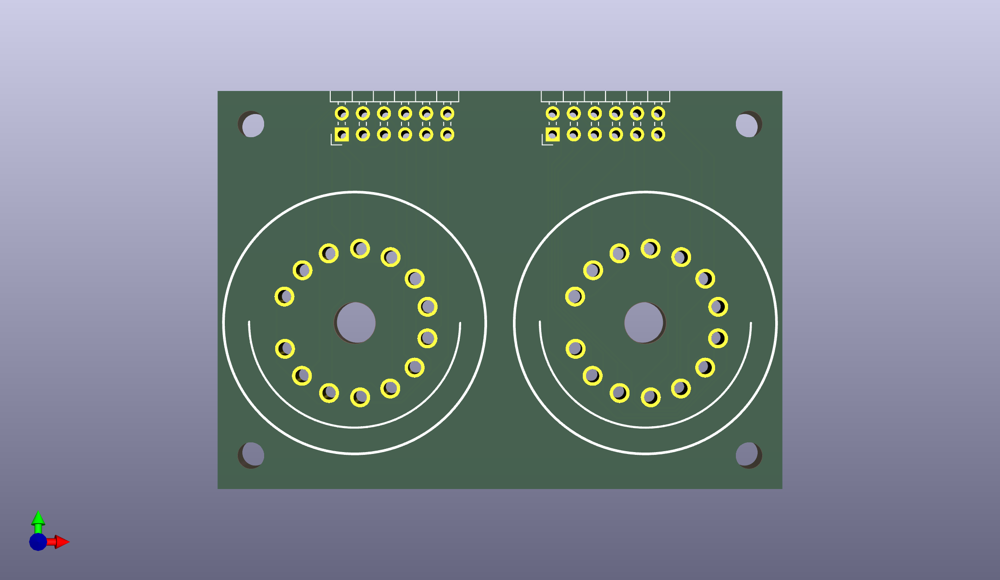
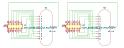
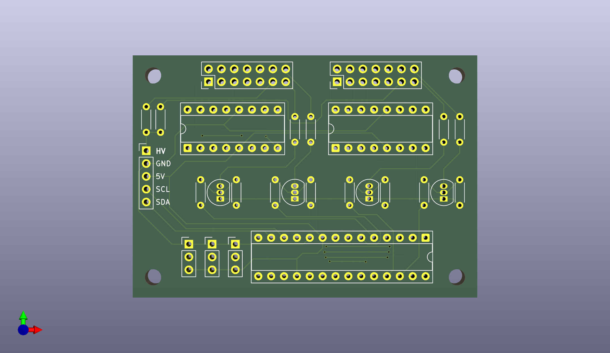
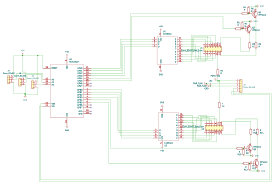
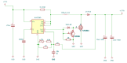

# KiCad Projects

趣味の電子工作で作った基板の KiCad データ用リポジトリです。

---

## 1. Nixie Tube Related

これらを利用した自作ニキシー管時計をブログで紹介しています ->

#### 1) IN-18 MountingBoard
ロマンある最大のニキシー管 **IN-18** のマウント基板です。

#### 2) DrivingBoard
ニキシー管用の汎用ドライブ基板です。

#### 3) Power Supply
IN-18をスタティック点灯すべく作成した電源の回路です。
> [!CAUTION]
> 基板データはありません。

